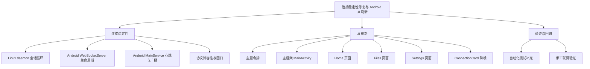
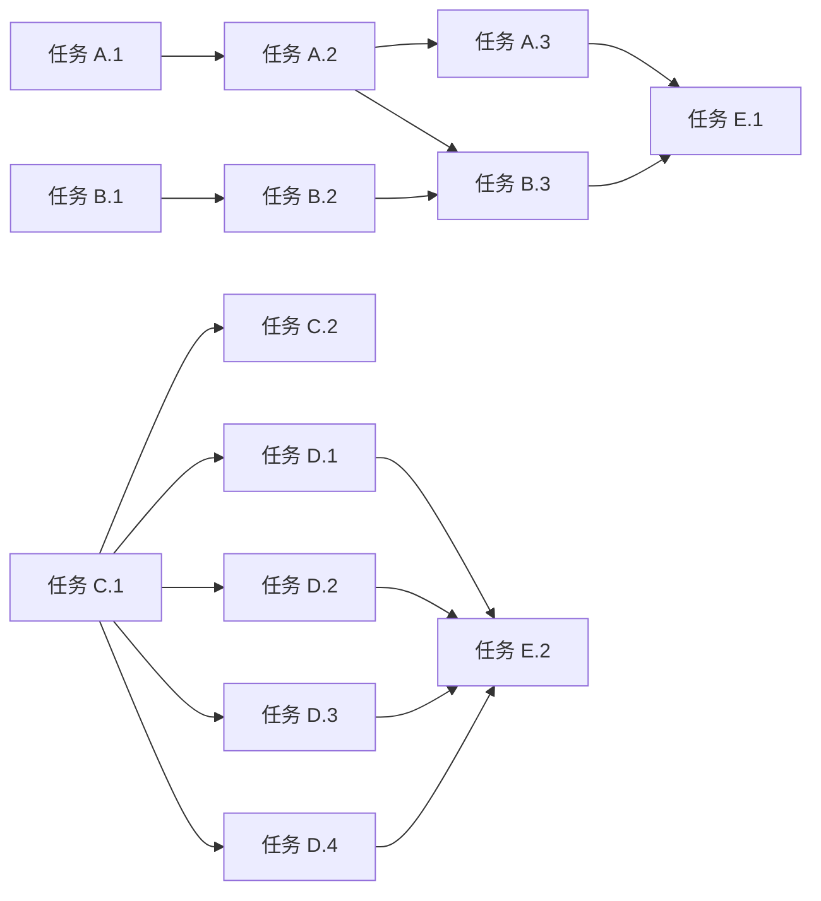

# 功能规划：连接稳定性修复与 Android UI 刷新

**规划时间**：2026-03-24
**预估工作量**：24 任务点

---

## 1. 功能概述

### 1.1 目标

围绕现有 Monux 架构做一次低风险收敛式改造：

- 目标 A：稳定 Android 与 Linux daemon 之间的 WebSocket 长连接，减少 `no close frame received or sent` 类异常断连，完善断线、重连、关闭握手与异常清理流程，同时保持现有协议、服务职责和功能集合不变。
- 目标 B：对 Android Compose UI 做“降噪优先”的视觉与层级整理，以手机优先为原则简化主界面、文件页、设置页和连接卡片，但不引入大规模导航改造。

### 1.2 范围

**包含**：
- Linux daemon 会话循环、重连、心跳、异常与 close 流程梳理
- Android WebSocket 服务端连接生命周期、广播失败清理、服务停止时关闭握手优化
- 保持现有 JSON 协议与消息类型不变前提下的连接健壮性增强
- Android 主题令牌补齐：间距、圆角、层级、文字使用约束
- Home / Files / Settings 页面层级精简与手机布局优化
- 连接状态卡片去过度动效与过度强调
- 补充针对连接链路的验证方案与回归检查项

**不包含**：
- 协议版本升级或消息结构重设计
- Android 端从服务端改为客户端
- 大型导航重构、单 Activity 多 NavGraph 重写
- 新功能开发（如新增页面、全新设置体系、文件历史数据库）
- Linux / Android 服务职责重新拆层

### 1.3 技术约束

- 保持现有 WebSocket 协议类型与业务行为兼容
- 保持 Android `MainService` 和 Linux `MonuxDaemon` 的现有角色
- 尽量采用局部重构与补充保护逻辑，避免架构迁移
- UI 以 Compose Material 3 为基础，不引入额外设计系统库
- 手机优先，不强行兼顾大屏专门布局
- 优先修复断开/重连稳定性，再做 UI 刷新，降低联调噪音

---

## 2. WBS 任务分解

### 2.1 分解结构图

### 2.2 任务清单

#### 模块 A：连接稳定性 - Linux daemon（7 任务点）

**文件**: `/home/N1nE/Progress/202603/Monux/linux-daemon/main.py`

- [ ] **任务 A.1**：梳理会话状态机与断线分类（2 点）
  - **输入**：现有 `MonuxDaemon.run()`、`_run_session()`、日志报错 `no close frame received or sent`
  - **输出**：明确的断线分类表与会话退出策略
  - **关键步骤**：
    1. 区分正常关闭、远端异常断开、发送失败、解析失败、发现失败等场景
    2. 明确哪些异常应直接触发重连，哪些应记录并降级退出会话
    3. 规划 dashboard 状态文案与日志字段统一

- [ ] **任务 A.2**：收敛连接建立与关闭流程（3 点）
  - **输入**：`websockets.connect(... ping_interval=None, ping_timeout=None)`、`_on_connect()`、`finally` 清理块
  - **输出**：更稳健的连接/退出流程设计
  - **关键步骤**：
    1. 评估是否继续只保留应用层心跳，或引入受控 transport ping 参数但不改变应用层协议
    2. 规划 `async for raw in ws` 结束时的 close 分类与日志
    3. 增加会话级“发送保护”设计，避免关闭中仍发送 `ping`、`clipboard`、`file.received` 等消息
    4. 明确 `heartbeat_task`、`clipboard_task` 的取消顺序与 ws 关闭顺序

- [ ] **任务 A.3**：统一发送路径异常保护（2 点）
  - **输入**：`_heartbeat_loop()`、`_push_clipboard_update()`、`MessageDispatcher` 内多处 `ws.send()`
  - **输出**：统一发送保护方案
  - **关键步骤**：
    1. 识别所有 `ws.send()` 调用点
    2. 规划一个集中式安全发送入口或最小封装
    3. 约定发送失败后的行为：记录、停止当前会话、避免重复异常刷屏

#### 模块 B：连接稳定性 - Android WebSocket server 与服务生命周期（8 任务点）

**文件**:
- `/home/N1nE/Progress/202603/Monux/android-app/app/src/main/kotlin/com/monux/network/WebSocketServer.kt`
- `/home/N1nE/Progress/202603/Monux/android-app/app/src/main/kotlin/com/monux/MainService.kt`
- `/home/N1nE/Progress/202603/Monux/android-app/app/src/main/kotlin/com/monux/protocol/Protocol.kt`
- `/home/N1nE/Progress/202603/Monux/android-app/app/src/main/kotlin/com/monux/ui/state/ConnectionState.kt`

- [ ] **任务 B.1**：梳理 Android 端 socket 生命周期与清理缺口（2 点）
  - **输入**：`WebSocketServer.startServer()`、`stopServer()`、`broadcast()`、`ClientSocket.onClose/onException`
  - **输出**：Android 端连接生命周期问题清单
  - **关键步骤**：
    1. 确认 `broadcast` 失败后未清除失效 socket 的风险
    2. 确认 `onException` 只记日志、不移除连接的风险
    3. 确认 service 停止时 close handshake 是否足够完整

- [ ] **任务 B.2**：设计服务端优雅关闭与失效连接回收（3 点）
  - **输入**：现有 `stopServer()`、`broadcast()`、`onException()` 行为
  - **输出**：Android 端优雅关闭改造方案
  - **关键步骤**：
    1. 规划 broadcast/send 失败后的 socket 剔除与状态回调策略
    2. 规划 `onException`、`onClose`、`stopServer` 的单一清理路径，避免重复回调
    3. 保证 service 停止时尽量发送 close frame，并在超时/异常后强制回收

- [ ] **任务 B.3**：收敛心跳策略与连接状态展示（2 点）
  - **输入**：`MainService` 每 15s 广播 JSON `ping`、Linux 同步 15s 发送 `ping`
  - **输出**：单一、可解释的心跳策略
  - **关键步骤**：
    1. 决定保留双向应用层心跳但加入更强异常保护，或调整为单侧主动、另一侧仅响应
    2. 保证不改变现有 `ping/pong` 协议类型
    3. 规划状态流中“等待连接 / 已连接 / 等待重连 / 服务启动失败”边界

- [ ] **任务 B.4**：盘点受连接波动影响的发送入口（1 点）
  - **输入**：`forwardNotification`、`forwardSms`、文件发送、投屏控制、远程输入
  - **输出**：受影响入口回归清单
  - **关键步骤**：
    1. 标记所有通过 `webSocketServer?.broadcast(...)` 的路径
    2. 识别连接中断期间应静默失败、重试或仅更新 UI 的行为

#### 模块 C：UI 刷新 - 主题令牌与整体骨架（4 任务点）

**文件**:
- `/home/N1nE/Progress/202603/Monux/android-app/app/src/main/kotlin/com/monux/ui/theme/Theme.kt`
- `/home/N1nE/Progress/202603/Monux/android-app/app/src/main/kotlin/com/monux/MainActivity.kt`

- [ ] **任务 C.1**：补充基础设计令牌（2 点）
  - **输入**：现有 Theme 仅定义颜色
  - **输出**：轻量主题令牌规划
  - **关键步骤**：
    1. 定义 spacing / radius / elevation / typography usage 的最小令牌集合
    2. 约束页面与卡片统一使用令牌，不再散落硬编码 `dp`
    3. 保持与 MaterialTheme 兼容，不引入重型 design system

- [ ] **任务 C.2**：简化主框架视觉层级（2 点）
  - **输入**：`MainActivity.kt` 中渐变背景、径向 glow、AnimatedContent、悬浮导航、LargeTopAppBar
  - **输出**：更克制的主框架方案
  - **关键步骤**：
    1. 明确保留一层背景强调，去除多重背景竞争
    2. 缩减顶部信息量与页面过场强度
    3. 保留底部导航结构，但降低悬浮感与过度装饰

#### 模块 D：UI 刷新 - Home / Files / Settings / ConnectionCard（5 任务点）

**文件**:
- `/home/N1nE/Progress/202603/Monux/android-app/app/src/main/kotlin/com/monux/ui/screens/HomeScreen.kt`
- `/home/N1nE/Progress/202603/Monux/android-app/app/src/main/kotlin/com/monux/ui/screens/FilesScreen.kt`
- `/home/N1nE/Progress/202603/Monux/android-app/app/src/main/kotlin/com/monux/ui/screens/SettingsTab.kt`
- `/home/N1nE/Progress/202603/Monux/android-app/app/src/main/kotlin/com/monux/ui/screens/SettingsScreen.kt`
- `/home/N1nE/Progress/202603/Monux/android-app/app/src/main/kotlin/com/monux/ui/components/ConnectionCard.kt`

- [ ] **任务 D.1**：重组 Home 首屏信息密度（2 点）
  - **输入**：当前 Home 的大卡片 + 连接卡 + 概览卡 + 能力矩阵
  - **输出**：手机优先的 Home 信息结构
  - **关键步骤**：
    1. 让首页聚焦“连接摘要 + 主操作 + 紧凑状态”
    2. 缩减卡片数量与标题层级
    3. 保留 feature toggle，但降低首屏压迫感

- [ ] **任务 D.2**：Files 页改为手机优先列表（1 点）
  - **输入**：`FilesScreen.kt` 当前固定双列
  - **输出**：单列或自适应但默认 list-first 的结构
  - **关键步骤**：
    1. 将关键传输状态放在顶部
    2. 次级信息改为简洁列表块
    3. 避免在窄屏上并排信息卡导致拥挤

- [ ] **任务 D.3**：Settings 去双重强调（1 点）
  - **输入**：`SettingsTab.kt` 头部 HighlightCard + `SettingsScreen.kt` 多层卡片强调
  - **输出**：更接近系统设置的分组式结构
  - **关键步骤**：
    1. 去掉或弱化 promo-like hero 区块
    2. 保留连接、外观、关于三组，但简化文案与卡片层次
    3. 颜色选择器保留功能，弱化视觉噪音

- [ ] **任务 D.4**：ConnectionCard 去过度动效与强调（1 点）
  - **输入**：pulse、shimmer、强渐变、大圆角、大字重
  - **输出**：稳定、状态导向的连接卡设计
  - **关键步骤**：
    1. 去除持续脉冲与 shimmer
    2. 保留状态色，但收敛到单一重点
    3. 优先展示设备名、连接状态、地址等核心信息

#### 模块 E：验证与回归（4 任务点）

**文件**:
- `/home/N1nE/Progress/202603/Monux/linux-daemon/tests/test_integration.py`
- `/home/N1nE/Progress/202603/Monux/linux-daemon/tests/mock_android.py`
- Android 侧如已有测试目录则补充对应测试；若暂无，则至少形成手工验证清单

- [ ] **任务 E.1**：补充 Linux 侧连接稳定性测试点（2 点）
  - **输入**：现有集成测试、mock Android 夹具
  - **输出**：扩展后的链路测试计划
  - **关键步骤**：
    1. 增加异常断开、无 close frame、服务端关闭、重连恢复场景
    2. 验证 `hello/hello_ack/ping/pong` 保持兼容
    3. 验证断线后不会留下悬挂任务或重复发送异常

- [ ] **任务 E.2**：制定 Android 手工 UI/连接验证矩阵（2 点）
  - **输入**：改造后的连接链路与 UI 页面
  - **输出**：回归步骤清单
  - **关键步骤**：
    1. 覆盖服务冷启动、后台常驻、锁屏/解锁、Wi‑Fi 切换、Linux daemon 重启
    2. 覆盖 Home / Files / Settings 三页手机端浏览与操作
    3. 覆盖通知、剪贴板、短信、文件、投屏、远程输入基础冒烟验证

---

## 3. 依赖关系

### 3.1 依赖图

### 3.2 依赖说明

| 任务 | 依赖于 | 原因 |
|------|--------|------|
| A.2 | A.1 | 需先明确断线分类，才能定义关闭与重连策略 |
| A.3 | A.2 | 发送保护要依附最终会话关闭模型 |
| B.2 | B.1 | 需先识别 Android 端失效 socket 与重复回调问题 |
| B.3 | A.2、B.2 | 心跳策略必须同时考虑两端会话退出与清理方式 |
| C.2 | C.1 | 主框架收敛要基于统一令牌 |
| D.1-D.4 | C.1 | 页面收敛应统一使用主题令牌 |
| E.1 | A.3、B.3 | 测试点要覆盖最终的连接策略 |
| E.2 | D.1-D.4 | 手工验证需要基于落地后的 UI 结构 |

### 3.3 并行任务

以下任务可以并行推进：
- A.1 ∥ B.1
- C.1 ∥ A.2（在不相互改文件的前提下）
- D.2 ∥ D.3 ∥ D.4
- E.1 ∥ E.2（在实现基本完成后并行执行）

---

## 4. 实施建议

### 4.1 技术选型

| 需求 | 推荐方案 | 理由 |
|------|----------|------|
| WebSocket 稳定性 | 以现有应用层 `ping/pong` 为主，优先补齐 close/error/cleanup，而非改协议 | 变更面最小，风险最低 |
| 发送失败处理 | 集中化安全发送与失效连接剔除 | 避免关闭中多点抛错和重复日志 |
| Android 服务状态 | 保持 `MainService` 为编排中心，仅做生命周期收敛 | 避免大规模职责重拆 |
| UI 收敛 | 基于现有 Compose + Material 3 做轻量令牌化 | 不引入额外框架，适合低风险重构 |
| 手机布局 | list-first、单主视觉、减少卡片层级 | 直接解决窄屏拥挤与层级混乱 |

### 4.2 潜在风险

| 风险 | 影响 | 缓解措施 |
|------|------|----------|
| 两端都发应用层心跳导致竞态关闭更频繁 | 高 | 先梳理心跳职责与异常退出路径，再决定是否保留双向主动 ping |
| Android `broadcast` 失败后残留脏连接 | 高 | 将发送失败纳入统一清理路径，并同步更新 UI 状态 |
| Linux 多处 `ws.send()` 在断线期间抛重复异常 | 高 | 增加统一发送保护，禁止关闭中继续发包 |
| UI 改动过散导致视觉不统一 | 中 | 先定义主题令牌，再逐页改造 |
| 调整 Home / Files 层级时误伤功能入口可见性 | 中 | 保留现有主要操作与 feature toggle，仅改结构与样式 |
| 缺少 Android 自动化测试 | 中 | 提前定义手工验证矩阵，并优先补 Linux 侧协议测试 |

### 4.3 测试策略

- **单元/局部测试**：
  - Linux daemon 会话退出、异常处理、心跳发送保护
  - 协议兼容：`hello` / `hello_ack` / `ping` / `pong`
- **集成测试**：
  - Linux daemon 对 mock Android 的连接、异常断开、重连恢复
- **手工测试**：
  - Android 服务启动/停止、前后台切换、网络切换
  - Home / Files / Settings 在手机尺寸下的视觉与操作流
  - 通知、剪贴板、短信、文件、投屏、远程输入冒烟回归

---

## 5. 验收标准

功能完成需满足以下条件：

### 5.1 连接稳定性
- [ ] Linux 端在 Android 正常停止服务时，不再频繁出现未处理的 `no close frame received or sent` 异常刷屏
- [ ] Android 或 Linux 任一端重启后，另一端能在预期重连周期内恢复连接
- [ ] 会话断开后心跳任务、剪贴板任务不会持续向已关闭连接发送消息
- [ ] Android `broadcast` 遇到失效连接后，可回收异常 socket，不造成持续性告警堆积
- [ ] 现有 `hello`、`hello_ack`、`ping`、`pong` 与业务消息协议保持兼容

### 5.2 UI 刷新
- [ ] MainActivity 仅保留一套主视觉重点，不再同时出现强渐变、径向 glow、重动画和高悬浮导航的叠加抢焦
- [ ] Home 首屏可清晰分辨“连接摘要、主操作、紧凑状态、能力开关”四个层次
- [ ] Files 页面在手机宽度下不再强制双列拥挤展示
- [ ] Settings 页面移除双重强调，呈现为稳定的分组设置结构
- [ ] ConnectionCard 不再包含持续 pulse/shimmer 类强动效，但保留明确状态反馈

### 5.3 回归质量
- [ ] Linux 侧相关集成测试通过
- [ ] Android 手机端关键手工检查项全部通过
- [ ] 不引入新协议、不减少现有能力入口

---

## 6. 推荐执行顺序

### 工作流 A：连接稳定性
1. 盘点 Linux `main.py` 的会话、心跳、发送与退出路径
2. 盘点 Android `WebSocketServer.kt` 与 `MainService.kt` 的 socket 生命周期与广播路径
3. 先定义双端的断线分类与统一清理策略
4. 先改 Android 端失效连接回收与服务停止优雅关闭
5. 再改 Linux 端安全发送、任务取消顺序与会话退出收敛
6. 最后补 Linux 侧集成测试与双端联调

### 工作流 B：UI 刷新
1. 先在 `Theme.kt` 补主题令牌与统一约束
2. 收敛 `MainActivity.kt` 主框架视觉层级
3. 改 `ConnectionCard.kt`，建立新卡片风格基线
4. 改 `HomeScreen.kt` 首屏结构
5. 改 `FilesScreen.kt` 为手机优先 list-first
6. 改 `SettingsTab.kt` + `SettingsScreen.kt` 为分组设置结构
7. 进行手机端视觉回归

### 合并后的总执行顺序
1. A.1 + B.1：连接问题盘点
2. A.2 + B.2：双端关闭/清理策略定稿
3. B.3 + A.3：心跳与发送保护落地
4. E.1：先完成 Linux 侧稳定性测试补强
5. C.1：主题令牌落地
6. C.2：主框架收敛
7. D.4：先改 ConnectionCard 基线样式
8. D.1：Home 重组
9. D.2：Files 重组
10. D.3：Settings 重组
11. E.2：完整手工回归与联调

---

## 7. 影响文件清单

### 连接稳定性主文件
- `/home/N1nE/Progress/202603/Monux/linux-daemon/main.py`
- `/home/N1nE/Progress/202603/Monux/linux-daemon/protocol.py`
- `/home/N1nE/Progress/202603/Monux/linux-daemon/tests/test_integration.py`
- `/home/N1nE/Progress/202603/Monux/linux-daemon/tests/mock_android.py`
- `/home/N1nE/Progress/202603/Monux/android-app/app/src/main/kotlin/com/monux/network/WebSocketServer.kt`
- `/home/N1nE/Progress/202603/Monux/android-app/app/src/main/kotlin/com/monux/MainService.kt`
- `/home/N1nE/Progress/202603/Monux/android-app/app/src/main/kotlin/com/monux/protocol/Protocol.kt`
- `/home/N1nE/Progress/202603/Monux/android-app/app/src/main/kotlin/com/monux/ui/state/ConnectionState.kt`

### UI 刷新主文件
- `/home/N1nE/Progress/202603/Monux/android-app/app/src/main/kotlin/com/monux/MainActivity.kt`
- `/home/N1nE/Progress/202603/Monux/android-app/app/src/main/kotlin/com/monux/ui/theme/Theme.kt`
- `/home/N1nE/Progress/202603/Monux/android-app/app/src/main/kotlin/com/monux/ui/screens/HomeScreen.kt`
- `/home/N1nE/Progress/202603/Monux/android-app/app/src/main/kotlin/com/monux/ui/screens/FilesScreen.kt`
- `/home/N1nE/Progress/202603/Monux/android-app/app/src/main/kotlin/com/monux/ui/screens/SettingsTab.kt`
- `/home/N1nE/Progress/202603/Monux/android-app/app/src/main/kotlin/com/monux/ui/screens/SettingsScreen.kt`
- `/home/N1nE/Progress/202603/Monux/android-app/app/src/main/kotlin/com/monux/ui/components/ConnectionCard.kt`

### 可能受波及但应尽量少动的关联文件
- `/home/N1nE/Progress/202603/Monux/android-app/app/src/main/kotlin/com/monux/ui/state/ConnectionState.kt`
- `/home/N1nE/Progress/202603/Monux/android-app/app/src/main/kotlin/com/monux/protocol/Protocol.kt`

---

## 8. 验证步骤

### 8.1 连接稳定性验证
1. 启动 Android app 前台服务，确认 mDNS 广播成功
2. 启动 Linux daemon，确认完成 `hello -> hello_ack` 握手
3. 保持连接 5-10 分钟，确认无异常断线刷屏
4. 在 Android 端停止服务，确认 Linux 端进入“等待重连”而非异常循环报错
5. 重启 Android 服务，确认 Linux 自动重连
6. 在 Linux 运行期间切换 Wi‑Fi / 临时断网 / 恢复网络，确认可恢复
7. 在连接波动期间触发通知、剪贴板、文件、远程输入，确认不会因脏连接导致连续异常

### 8.2 UI 验证
1. 在常见手机尺寸下浏览 Home / Files / Settings
2. 检查首页是否先看到连接摘要，再看到主操作与关键状态
3. 检查文件页是否以单列/列表优先呈现，不再拥挤
4. 检查设置页是否为分组信息，不再有营销式大卡抢焦
5. 检查 ConnectionCard 是否保留清晰状态但无强动效噪音
6. 切换 Dynamic Color 与自定义主色，确认主题令牌下的控件观感统一

---

## 9. 后续优化方向（可选）

Phase 2 可考虑：
- 为 Android 侧补充 Compose screenshot test / instrumentation 冒烟测试
- 将连接状态与最后心跳时间抽成更明确的 state 字段，便于 UI 与日志统一
- 为 Linux daemon 增加更细粒度的 close code / reconnect backoff 观测指标
- 逐步把通用卡片样式沉淀为更稳定的 UI 基础组件
