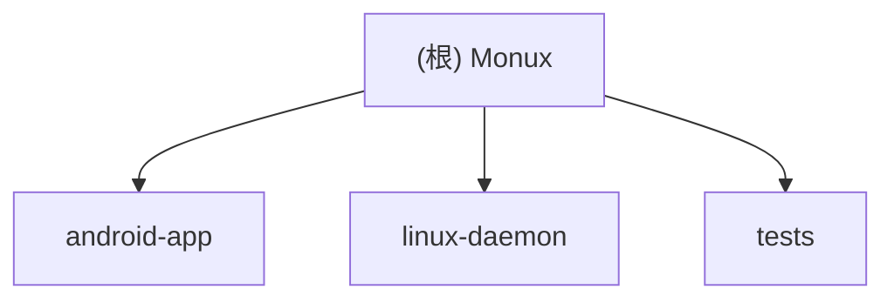

# Monux

## 项目愿景
Monux 旨在提供一套轻量的 Android ↔ Linux 原生互联方案，不依赖 KDE Connect 生态，核心能力围绕通知镜像、剪贴板同步、短信镜像/回复、文件快传、投屏与远程输入展开。当前仓库由 Android 前台服务端与 Linux 守护进程端组成，通过 WebSocket JSON 协议和 mDNS 自动发现完成局域网连接。

## 架构总览
- `android-app/`：Android 应用，内置前台 `MainService`、WebSocket 服务端、mDNS 广播、Compose UI、系统能力接入点（通知、短信、分享、Quick Settings Tile）。
- `linux-daemon/`：Linux 守护进程，作为 WebSocket 客户端连接 Android，负责消息分发、本地系统集成（`notify-send`、剪贴板工具、`scrcpy`、`xdotool`/`ydotool`、`rofi`）。
- `tests/`：以 Python 为主的协议与功能回归测试，覆盖握手、文件接收、投屏控制相关路径。
- `plans/`：阶段性设计/实施计划，记录 Phase 7 远程输入与 UI 改造方向。
- `release/`、`assets/`：分别存放 APK 构建产物与图片资源，作为二进制/静态资产处理，仅记录路径。

### 模块结构图


## 模块索引
| 模块 | 语言 | 职责 | 入口/启动 | 测试情况 | 配置文件 |
| --- | --- | --- | --- | --- | --- |
| `android-app` | Kotlin, Gradle | Android 端服务、UI 与系统桥接 | `app/src/main/kotlin/com/monux/MainActivity.kt`, `MainService.kt` | 无独立 Android instrumentation/unit test；由根级 Python 测试做部分源码约束 | `build.gradle.kts`, `app/build.gradle.kts`, `settings.gradle.kts`, `AndroidManifest.xml` |
| `linux-daemon` | Python | Linux 端守护进程、消息分发与桌面集成 | `linux-daemon/main.py` | 有协议/文件/投屏相关 pytest | `requirements.txt` |
| `tests` | Python | 回归测试与 mock Android 协议对端 | `tests/test_integration.py`, `tests/mock_android.py` | 已存在 3 组主要测试文件 | `TESTING.md` |

## 运行与开发
### Linux daemon
```bash
cd linux-daemon
pip install -r requirements.txt
python3 main.py
```

### Android app
- Gradle 插件：Android Application `8.4.1`，Kotlin Android `1.9.24`
- `compileSdk/targetSdk = 34`，`minSdk = 29`
- 当前 `versionName = "0.1.4"`，`versionCode = 7`

### 关键运行依赖
- Linux：`notify-send`、`wl-copy/wl-paste` 或 `xclip/xsel`、`scrcpy`、`xdotool` 或 `ydotool`、`rofi`
- Android：前台服务、通知监听、短信权限、Quick Settings Tile、SpeechRecognizer、系统分享入口

## 测试策略
- 主要测试位于 `tests/`，通过禁用 pytest 插件自动加载来提升稳定性：
```bash
PYTEST_DISABLE_PLUGIN_AUTOLOAD=1 python3 -m pytest -q tests/test_integration.py
PYTEST_DISABLE_PLUGIN_AUTOLOAD=1 python3 -m pytest -q tests/test_phase5_file.py
PYTEST_DISABLE_PLUGIN_AUTOLOAD=1 python3 -m pytest -q tests/test_phase6_screen.py
```
- `test_integration.py` 以源码断言方式校验握手与 ping/pong。
- `test_phase5_file.py` 校验文件目录创建、分块写入、接收完成确认与错误清理。
- `test_phase6_screen.py` 校验 `scrcpy` 控制器与 Android QS Tile/Manifest 连线。
- Android UI、通知镜像、短信收发、远程输入语音链路当前仍依赖手工验证。

## 编码规范
- Android 侧采用 Kotlin + Jetpack Compose + `MainService` 单例状态流模式，协议集中在 `com.monux.protocol.Protocol`。
- Linux 侧采用 Python `dataclass` + dispatcher pattern，系统命令通过 `subprocess` 调用，协议集中在 `linux-daemon/protocol.py`。
- 协议报文统一采用 `{type, payload}` JSON 结构，Android 与 Linux 两端各自维护常量与构造器。
- 仓库中未发现 `eslint`、`ruff`、`golangci-lint`、`detekt`、`ktlint` 等质量工具配置文件；当前质量保障主要依赖手工约束与 pytest。

## AI 使用指引
- 优先从三个核心入口理解系统：`android-app/.../MainService.kt`、`linux-daemon/main.py`、双端 `Protocol` 文件。
- 调试跨端问题时，先核对消息类型常量是否在 Android 与 Linux 双端对齐，再检查对应 handler 是否已注册。
- 处理功能开关问题时，先看 Android `ConnectionState.FeatureFlags` 与 `MainService.updateFeatureFlags`；Linux 侧通常不再二次鉴权，而是执行收到的命令。
- 二进制与产物目录如 `release/`、`assets/*.png`、`android-app/gradle/wrapper/gradle-wrapper.jar` 不需要深入读取。

## 变更记录 (Changelog)
- 2026-03-24 17:25:15 — 初始化根级 AI 上下文文档，补充模块索引、Mermaid 模块结构图、运行测试摘要与扫描覆盖率基线。
