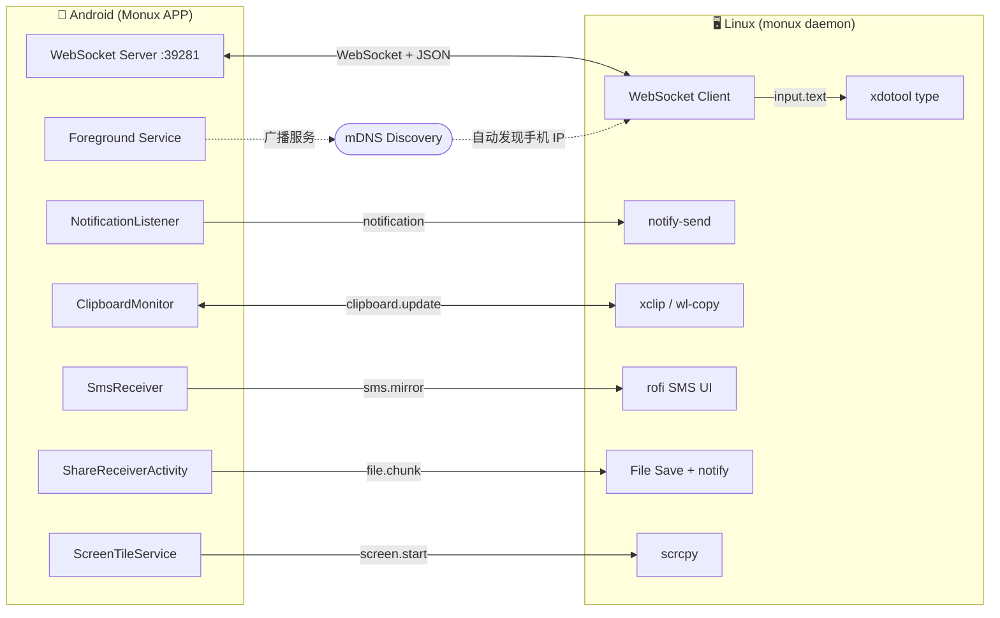

<div align="center">

<svg width="600" height="120" viewBox="0 0 600 120" xmlns="http://www.w3.org/2000/svg">
  <defs>
    <linearGradient id="bg" x1="0%" y1="0%" x2="100%" y2="0%">
      <stop offset="0%" style="stop-color:#1a1a2e"/>
      <stop offset="100%" style="stop-color:#16213e"/>
    </linearGradient>
    <linearGradient id="accent" x1="0%" y1="0%" x2="100%" y2="0%">
      <stop offset="0%" style="stop-color:#FF6900"/>
      <stop offset="100%" style="stop-color:#FF8C42"/>
    </linearGradient>
  </defs>
  <rect width="600" height="120" rx="16" fill="url(#bg)"/>
  <text x="48" y="72" font-family="-apple-system,BlinkMacSystemFont,'Segoe UI',sans-serif" font-size="52" font-weight="800" fill="url(#accent)">Monux</text>
  <text x="48" y="100" font-family="-apple-system,BlinkMacSystemFont,'Segoe UI',sans-serif" font-size="16" fill="#8892a4" letter-spacing="2">MOBILE · LINUX · BRIDGE</text>
  <circle cx="520" cy="40" r="18" fill="none" stroke="#FF6900" stroke-width="2" opacity="0.6"/>
  <circle cx="560" cy="40" r="18" fill="none" stroke="#FF6900" stroke-width="2" opacity="0.6"/>
  <line x1="538" y1="40" x2="542" y2="40" stroke="#FF6900" stroke-width="2"/>
  <text x="510" y="45" font-family="monospace" font-size="11" fill="#FF6900">📱</text>
  <text x="550" y="45" font-family="monospace" font-size="11" fill="#4fc3f7">🖥</text>
  <text x="480" y="90" font-family="monospace" font-size="10" fill="#4fc3f7" opacity="0.7">WebSocket · mDNS</text>
</svg>

# Monux

**让 Linux 桌面与 Android 手机无缝互联，原生体验，无需 KDE。**  
**Seamless Linux ↔ Android integration. No KDE required.**

[](LICENSE)
[]()
[]()
[](https://github.com/N1nEmAn/Monux)

</div>

---

## ✨ 功能 / Features

| 功能 | Feature | 说明 |
|------|---------|------|
| 🔔 通知镜像 | Notification Mirror | 手机通知实时推送到 Linux 桌面 |
| 📋 剪贴板同步 | Clipboard Sync | 双向实时同步，防循环回写 |
| 💬 短信镜像 | SMS Mirror | 在 Linux 查看并回复短信 |
| 📁 文件快传 | File Transfer | 系统分享菜单一键传文件到 Linux |
| 🖥 投屏 | Screen Mirror | 基于 scrcpy，Quick Settings 一键开启 |
| ⌨️ 远程输入 | Remote Input | 手机语音/打字，直接输入到 Linux 焦点窗口 |

---

## 🏗 架构 / Architecture



---

## 🚀 快速开始 / Quick Start

### Linux 端

```bash
git clone https://github.com/N1nEmAn/Monux.git
cd Monux/linux-daemon
pip install -r requirements.txt

# 安装依赖工具
sudo pacman -S xdotool libnotify xclip scrcpy  # Arch
# sudo apt install xdotool libnotify-bin xclip scrcpy  # Debian/Ubuntu

python3 main.py
```

### Android 端

1. 从 [Releases](https://github.com/N1nEmAn/Monux/releases) 下载最新 APK
2. 安装并授权：通知访问权限、短信权限、存储权限
3. 确保手机和 Linux 在同一局域网
4. 打开 APP，自动发现并连接

---

## 🧪 本地测试 / Local Testing

```bash
cd Monux/linux-daemon

# 运行所有测试
python3 -m pytest tests/ -v

# 模拟 Android 端连接测试
python3 tests/mock_android.py
```

详细测试说明见 [TESTING.md](TESTING.md)

---

## 📋 开发进度 / Roadmap

- [x] Phase 1 — 通信层（WebSocket + mDNS + 握手协议）
- [x] Phase 2 — 通知镜像
- [x] Phase 3 — 剪贴板双向同步
- [x] Phase 4 — 短信镜像/回复
- [x] Phase 5 — 文件快传（Share Sheet 集成）
- [x] Phase 6 — 投屏（scrcpy + Quick Settings Tile）
- [ ] Phase 7 — 远程键盘/语音输入（xdotool）
- [ ] APK 自动构建 CI
- [ ] 主色调自定义

---

## 📄 许可证 / License

This project is licensed under **CC BY-NC 4.0**.

- ✅ 非商业使用 / Non-commercial use
- ✅ 修改和分发 / Modify and distribute  
- ❌ 商业用途 / Commercial use prohibited
- ⚠️ 必须署名原作者 / Must credit original author
- ⚠️ 任何衍生项目必须将 [N1nEmAn](https://github.com/N1nEmAn) 列为贡献者

See [LICENSE](LICENSE) for details.

---

## 👥 贡献者 / Contributors

<a href="https://github.com/N1nEmAn">
  
</a>

**[N1nEmAn](https://github.com/N1nEmAn)** — Creator & Lead Developer

---

## ⭐ Star History

[](https://star-history.com/#N1nEmAn/Monux&Date)
